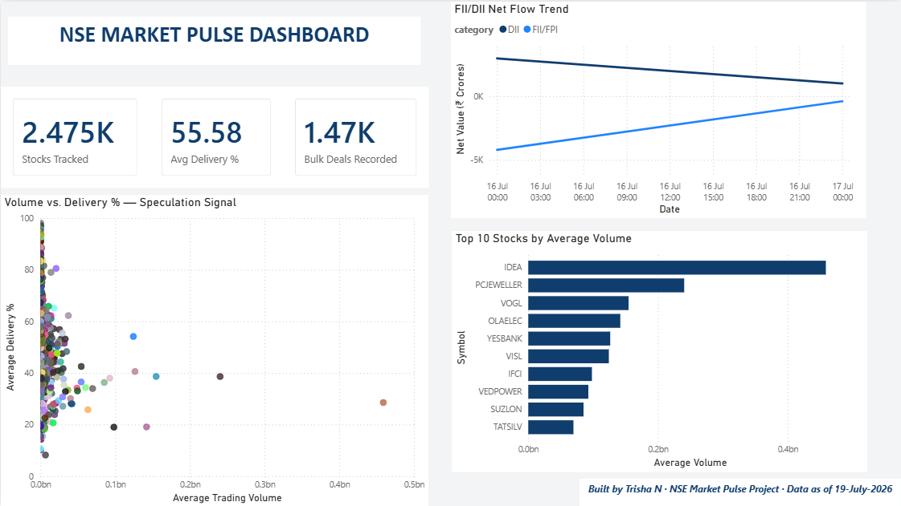

# NSE Market Pulse

## What this is
A data pipeline and analysis project that downloads daily equity market data from the National Stock Exchange (NSE) of India — price/volume, delivery percentage, bulk deals, and FII/DII institutional trading activity — cleans it, stores it in a SQL database, and analyzes trading patterns across stocks over time.

## Key finding
High-volume trading days show significantly lower delivery percentages than typical days (42.74% average vs. 57.00% average, based on a 90th-percentile volume threshold across 48,000+ stock-day observations). A Welch's t-test confirms this difference is highly statistically significant (t = -53.57, p < 0.001), suggesting that unusually high trading activity is more often driven by short-term/speculative trading rather than genuine investment accumulation.

This is a correlational finding, not a causal one — both high volume and low delivery could be driven by a shared underlying factor (e.g., interest in low-priced, volatile stocks), rather than volume directly causing lower delivery.

## Dashboard


An interactive Power BI dashboard (`nse_market_pulse_dashboard.pbix`) built on top of the SQLite database, featuring:
- KPI cards summarizing stocks tracked, average delivery %, and bulk deals recorded
- A scatter plot visualizing the core volume-vs-delivery-% finding
- Top 10 stocks by average trading volume
- FII/DII net flow trend over time

Data is exported from SQLite to CSV via `export_for_powerbi.py`; the dashboard is refreshed manually by re-running the export and clicking Refresh in Power BI Desktop.

## What it does so far
- Downloads NSE's daily equity bhavcopy (open/high/low/close price, volume, turnover, number of trades)
- Downloads NSE's daily delivery position data (delivery quantity and delivery percentage per stock)
- Downloads NSE's bulk deals data (large institutional trades, per stock per day)
- Downloads NSE's FII/DII daily institutional trading activity (foreign vs. domestic institutional buy/sell values)
- Handles NSE's session/cookie requirements needed to access data programmatically, including a `Referer` header for endpoints that require it
- Proactively filters out known NSE trading holidays using NSE's own holiday-calendar API, with reactive error handling as a fallback for unexpected failures
- Cleans and filters datasets down to regular equity (EQ series only), removing bonds, gold bonds, mutual funds, and other non-equity instruments mixed into the same files
- Handles real-world data messiness: whitespace in column names and values, non-numeric placeholder characters, inconsistent date formats and URL conventions across NSE's own endpoints
- Loads all cleaned datasets into a SQLite database as separate, joinable tables
- Joins price/volume data with delivery data by date and symbol
- Runs a statistical hypothesis test (Welch's t-test) comparing delivery percentage between high-volume and normal-volume trading days
- Implements a same-day upsert safeguard for FII/DII data (which NSE only ever publishes as a same-day snapshot, no historical range available), so the pipeline can be run multiple times a day without creating duplicates, while still capturing revisions to provisional figures
- Downloads NSE's corporate announcements (30-day range), covering board meetings, credit ratings, resignations, and 100+ other filing categories
- Visualizes all findings in an interactive Power BI dashboard, built on a CSV export of the SQLite data
- Downloads NSE's corporate financial results filing index (company, quarter, filing type, audited status) using a probe-then-fetch pattern — first querying the exact record count, then requesting precisely that many in a single request, to avoid data drift from NSE's live-updating feed shifting mid-pagination

## Tech stack
Python, pandas, requests, scipy, SQLite, SQL

## Project structure
```
nse-market-pulse/
├── fetch_one_day.py              # Single-day bhavcopy fetch (reference/debug)
├── fetch_range.py                # Multi-day bhavcopy fetch with holiday filtering
├── fetch_delivery_one_day.py     # Single-day delivery data fetch (reference/debug)
├── fetch_delivery_range.py       # Multi-day delivery data fetch with holiday filtering
├── fetch_bulk_deals_range.py     # Multi-day bulk deals fetch (per-day looping; endpoint ignores date-range params)
├── fetch_fii_dii.py              # Daily FII/DII snapshot with same-day upsert safeguard
├── fetch_announcements_range.py  # 30-day corporate announcements fetch
├── fetch_financial_results_one_day.py   # Financial results filing index exploration/reference
├── fetch_financial_results_range.py     # 30-day financial results filing index (probe-then-fetch)
├── export_for_powerbi.py         # Exports SQLite tables to CSV for Power BI
├── nse_market_pulse_dashboard.pbix  # Power BI dashboard file
├── screenshots/                  # Dashboard screenshot for this README
├── analyze.py                    # SQL queries against the stored data
├── stat_test.py                  # Statistical test: volume vs. delivery percentage
├── requirements.txt
├── .gitignore
└── README.md
```
## Setup

```bash
pip install -r requirements.txt
python fetch_range.py
python fetch_delivery_range.py
python fetch_bulk_deals_range.py
python fetch_fii_dii.py
python analyze.py
python stat_test.py
python fetch_announcements_range.py
python export_for_powerbi.py
```

The first three scripts download the last ~30 days of data (skipping weekends and NSE holidays automatically). `fetch_fii_dii.py` fetches only the current day's data and is meant to be run daily to build up history over time — NSE doesn't expose a historical range for this dataset. All data is stored in `nse_market_pulse.db` (a local SQLite file, not committed to this repo).

## Automation
`fetch_fii_dii.py` is scheduled to run automatically on weekdays via Windows Task Scheduler, since NSE only exposes same-day FII/DII figures with no historical backfill available. The task is configured to catch up if the scheduled run is missed (e.g., laptop was off), and the script's built-in upsert logic ensures re-running it on the same day safely overwrites that day's data rather than creating duplicates — useful since NSE's figures are provisional and may be revised intraday.

## Cloud automation
`fetch_fii_dii_cloud.py` runs automatically via GitHub Actions (`.github/workflows/fii_dii_daily.yml`) on weekdays at 8 PM IST, independent of any local machine. This was built after discovering that the local Windows Task Scheduler approach could miss a full trading day's data if the laptop wasn't powered on at all during that day — since NSE's FII/DII endpoint has no historical backfill, a missed day is permanently unrecoverable. Moving this specific pipeline to GitHub Actions removes that single point of failure. Results are committed directly to `data/fii_dii_history.csv` in this repo. The workflow can also be triggered manually from the Actions tab.

## Data sources
- **Bhavcopy**: `nsearchives.nseindia.com` (NSE's UDiFF format, adopted July 2024)
- **Delivery position data**: `archives.nseindia.com` (`sec_bhavdata_full` report)
- **Bulk deals**: `nseindia.com/api/historicalOR/bulk-block-short-deals` (internal API, discovered via browser DevTools network inspection; the API's `to` date parameter is not honored, so data must be fetched one day at a time)
- **FII/DII activity**: `nseindia.com/api/fiidiiTradeReact` (internal API; same-day snapshot only, no historical range; data is explicitly provisional per NSE, subject to revision via NSDL's custodial confirmation process)
- **Holiday calendar**: NSE's internal holiday-master API
- **Financial results filings**: `nseindia.com/api/integrated-filing-results` (NSE's current Integrated Filing system, replacing an older `corporates-financial-results` endpoint found to be stale/deprecated; provides filing metadata only — actual revenue/profit/EPS figures are embedded in linked XBRL/iXBRL documents, which are out of scope for this project)

All sources require no API key, just a browser-like session with valid cookies (and in some cases a valid `Referer` header). NSE's bulk deals endpoint additionally sits behind bot-detection on at least one alternate URL pattern that was tested and abandoned in favor of the working endpoint above. NSE has changed file formats/URLs before and may again — the download logic may need updates if that happens.

## Roadmap
- [ ] Extend statistical analysis to bulk deals and FII/DII (e.g., does bulk deal activity coincide with delivery spikes?)
- [ ] Add corporate financial results and shareholding pattern data
- [ ] Deploy dashboard as a live shareable link (Streamlit or Power BI Service)
- [ ] Migrate from SQLite to MySQL for a proper client-server database setup
- [ ] Shareholding pattern data — investigated (`nseindia.com/api/corporate-share-holdings-master`); real promoter/public % data confirmed available, but the dataset is fundamentally quarterly (not daily) and would need different date-handling logic than the rest of this project's daily time-series tables. Deferred as a lower-priority addition.

## Limitations
- Data reflects market-wide aggregate activity per stock per day, not per-broker or per-counterparty detail
- The volume/delivery relationship found here is correlational, not causal
- FII/DII data is provisional as published by NSE and may not reflect final, custodial-confirmed figures
- Bulk deals history in this project only extends as far back as the pipeline has actually been run manually — this source cannot be backfilled from NSE's public site
- FII/DII data is collected automatically via GitHub Actions (see Cloud automation below), reducing but not eliminating gap risk — a gap would still occur if GitHub Actions itself experienced an outage during a trading day, though this is far less likely than a personal laptop being off
- Analysis currently covers a ~1 month rolling window (bhavcopy/delivery); longer historical analysis would strengthen the finding
- Financial results data covers filing events only (who filed, when, for what quarter) — not the underlying revenue/profit/EPS figures, which would require XBRL parsing (a separate, substantial undertaking)